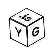

<!-- AUTO-GENERATED-CONTENT:START (STARTER) -->

  

<h2 align="center">my "portfolio" for when people ask</h2>

   <a href="https://2019.yg.is">
    2019 Site
  </a> ·
<a href="https://yg.is">
  <bold>2020 Site</bold>
  </a> ·
<a href="https://ygev.github.io/Trojan.JS.YouAreAnIdiot/">
  <bold>2024 Site :DDDDD</bold>
  </a>

 
  <b> 💫 Thank you for stopping by, have fun and try not to break anything.</b>

Written in React. Deployed in Gatsby. 

